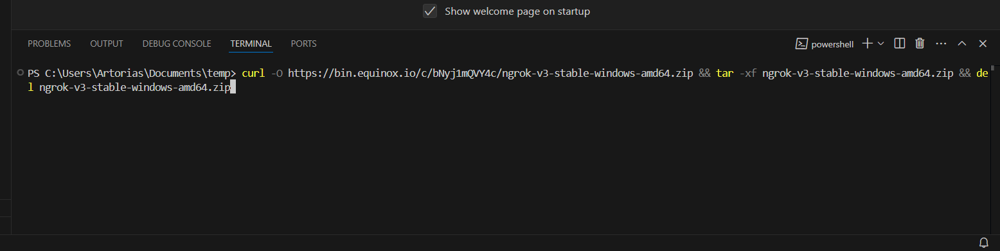

# Cisco Webex Bot Project

A Cisco Webex bot is an automated user within the Webex platform that can be interacted with, enhancing the user experience within an organisation.

# Task 1 - Set up and run hello bot

This first task will get you all set up to run a very simple hello bot that replies with a basic message.

### Create a Webex account

Go to [Cisco Webex for Developers](https://developer.webex.com/) and click **Sign up** on the top right corner. Fill in your details and follow the instructions to create an account.

### Create a Webex Bot

Go back to [Cisco Webex for Developers](https://developer.webex.com/) and log in with your account details.

Once logged in, click on the **Start Building Apps** button.

Here you will see a header saying **"Create a New App"**. Click on the **Create a Bot** button. This will be one of the 4 options you can choose from.

Once you have clicked on the **Create a Bot** button, you will be redirected to a page where you will need to fill in the information for your bot.

The steps are simple, the first field is the **Bot name**, this is the name that will be displayed on Webex when you interact with your bot.

The second field is the **Bot Username**, this is the username that will be used to interact with your bot. This can't be changed later, and will be used to invite the bot to your webex space.

The third field is the **Icon**, this is the avatar that will be displayed on Webex when you interact with your bot. You can either upload an image or use the predefined ones.

The fourth field is the **App Hub Description**, this is the description that will be displayed on Webex when you interact with your bot.

After filling in all the information, click on the button at the bottom of the page that says **Add Bot**.


This is the most important part, once the bot has been created, you will see a section that says **"Bot Access Token"**. This is essentially the key/password to your bot, it is standard practice to save this somewhere safe that no one can access.


Temporarily copy and paste the access token into notepad or any text editor, we will need it later.


<br>

### Install Git

"Git is a free and open source distributed version control system designed to handle everything from small to very large projects with speed and efficiency." [Link to install git](https://git-scm.com/download/).

Step by step:

If you are on windows, go to the [Git for Windows](https://git-scm.com/downloads/win) website and download the installer.

If you are on any Linux distribution, open the terminal and use your respective package manager to install git.

such as:

**MacOS**
```sh
xcode-select --install
```

**Debian/Ubuntu**
```sh
sudo apt-get install git
```

**Arch Linux**
```sh
sudo pacman -S git
```

If you are running the windows installer, once the installer is downloaded, launch it and follow the instructions, it may ask you to add git to your path, say yes to this. aside from that, you don't need to change anything during the installation.

### Install Python

"Python is an interpreted, high-level, general-purpose programming language" [Link to install the latest python version](https://www.python.org/downloads/).

Step by step:

Click on the highlighted link above if you are on windows to download the installer. then launch it, now this next step is **EXTREMELY IMPORTANT**.

When the installer asks you to install python to your PATH, say yes to this, it is important so that when you are using Visual Studio Code, it can correctly identify the python installation as well as use pip within the terminal. Failing to follow this step will cause a lot of problems later on. After the installation is complete, you can close the installer.

**Ignore this step if you are on Windows.** For Mac and Linux make sure to use Python 3 and that when using the ```python``` command in the terminal that it points to Python 3. You can check this by using the ```python --version``` command. If for whatever reason it points to python 2 (which is now end of life) substitue the python commands with ```python3``` and pip commands with ```pip3```.

**For MAC**
```sh
brew install python
```

**For Linux (Debian/Ubuntu)**
```sh
sudo apt-get install python3
```

**For Linux (Arch Linux)**
```sh
sudo pacman -S python
```

⚠️ **IMPORTANT:** When installing Python, make sure to check "Add Python to PATH"

### Install Visual Studio Code

"Visual Studio Code is a source-code editor made by Microsoft for Windows, Linux and macOS." [Link to download Visual Studio Code](https://code.visualstudio.com/download).

Step by step:

Click on the highlighted link above if you are on windows to download the installer. then launch it, and just follow the instructions, it will ask you to add visual studio code to your PATH, say yes to this. then you should be good to go.

**Ignore this step if you are on Windows.** For Mac and Linux, open the terminal and run the following command:

**Mac** 
```sh
brew install --cask visual-studio-code
```

**Linux (Debian/Ubuntu)**
```sh
sudo apt-get install code
```

**Linux (Arch Linux)**
```sh
sudo pacman -S visual-studio-code-bin
```

Once visual studio code is installed, launch it, and you should be greeted with a welcome screen where it will give you a quick tour of the interface. and your visual preferences, you can customise these to your liking.


After the welcome screen, you will be greeted with the main interface, this is where you will be doing most of your work.


On the left side of the screen, click **"Open Folder"**, and navigate to the directory you would like to work in. My recommendation is to create a new folder in your Documents folder called **"code"**.


Once you are done with that, click **"Select Folder"**.

Visual studio also features a bunch of extensions that you can install to help with your development, these are called **"Extensions"**.

One suggestion that is mandatory for this project is the **"Python"** extension, this will help you with syntax highlighting, linting, and other features that will help you with your development. It also allows you to run your code directly from the editor.


Click **"Install"** on the extension.

Now, navigate back to your project directory, and on the top left corner, click **Terminal** and then **New Terminal**.


If this is your first time using the terminal, do not worry, it is very simple to use once you learn the hang of it, all we will be using are the commands that we have already installed and mentioned in this project.

### Download Ngrok

"Ngrok exposes local servers behind NATs and firewalls to the public internet over secure tunnels." [Link to download ngrok](https://ngrok.com/download).

## Setup Bot

### 1. Open Terminal in Visual Studio Code

Using your previously opened terminal, you can run the following command to clone the git repository to your local machine.

```sh
git clone https://github.com/tomtvr/webex-python-bot-project
```

I will note that there is a more secure way to clone the repository, which requires you to set up ssh keys on your github account. If you do not have an account, you can create one [here](https://github.com/join).

**If you are content with not using ssh keys, you can skip the next step.**
On top of git, you will need to install github-cli, this is a command line tool that will allow you to interact with your github account. You can install it by running the following command:

**For windows**:
go to the [github-cli](https://cli.github.com/) website and download the installer. It should automatically set everything up after you click Install.

**For Mac**:
open the terminal and run the following command:
```sh
brew install github-cli
```

**For Linux (Debian/Ubuntu)**:
open the terminal and run the following command:
```sh
sudo apt-get install gh
```

**For Linux (Arch Linux)**:
open the terminal and run the following command:
```sh
sudo pacman -S github-cli
```

Once you have installed github-cli, you can authenticate your git credentials by running the following command:
```sh
gh auth login
```


This is the output of the command, it will ask you where you want to authenticate, here we will choose **"GitHub.com"**. and then press **Enter**. Then for the preferred protocol, we will choose **"SSH"**. and then press **Enter**. After that, it will ask you for a passphrase, you can leave this blank, and then press **Enter**. Then it will ask for the title of the key, you can press **Enter** again to use the default title. Then it will ask how you would like to authenticate, here we will choose **"Browser"**. and then press **Enter**.

Lastly, it will open a browser window where you can login with your github account. Once you have logged in, you will need to put an 8 digit code that was displayed in your terminal and paste it into the browser. After that, you will be authenticated and you can close the browser window and return to the terminal.

This setup will also allow you to clone the repository using ssh, which is a more secure method of cloning the repository.

```sh
git clone git@github.com:tomtvr/webex-python-bot-project.git
```

To go to the directory you have just cloned, simply run `cd webex-python-bot-project`. Note: You can press tab to autocomplete the directory name. Try running `dir` if you are on windows, or `ls` if you are on mac/linux, and check that you can see all the files you will need to get your Bot up and running.

We recomend using a python virtual environment to install your dependencies too. You can find help on this [here](https://docs.python.org/3/library/venv.html).

After installing Python, open terminal and run the following command to create a virtual environment:

```sh
python -m venv myvenv
```
This will create a python virtual environment in the code directory for you to use. To use this in the terminal you have to run the following command

### Mac/Linux
```sh
source ./myvenv/bin/activate
```

### Windows
```sh
.\myvenv\Scripts\activate
```

The required dependencies can then be installed using the following pip command:

```sh
pip install -r requirements.txt
```

Remember each time you create a new terminal, you need to activate your virtual environment. Visual Studio Code can help with automatically picking this up, information can be found [here](https://code.visualstudio.com/docs/python/environments#_creating-environments) on how to do this.

When running the virtual environment activation script on Windows, there could be some "Execution Policy" changes needed to do this.

You need to run the following command in powershell as an administrator:

```sh
Set-ExecutionPolicy -ExecutionPolicy RemoteSigned -Scope CurrentUser
```

More information for this can be found [here](https://docs.python.org/3/library/venv.html) and [here](https://learn.microsoft.com/en-us/powershell/module/microsoft.powershell.core/about/about_execution_policies?view=powershell-7.4).

## Run Bot


### 1. Setup Ngrok

**Using Windows**:
in your terminal, run the following command to download ngrok and automatically unzip it in your current directory as shown below:



```sh
curl -O https://bin.equinox.io/c/bNyj1mQVY4c/ngrok-v3-stable-windows-amd64.zip && tar -xf ngrok-v3-stable-windows-amd64.zip && del ngrok-v3-stable-windows-amd64.zip
```

**Using Mac**:

```sh
brew install ngrok
```

**Using Linux (Debian/Ubuntu)**:
```sh
sudo apt-get install ngrok
```

**Using Linux (Arch Linux)**:
```sh
sudo pacman -S ngrok
```

Once you press **Enter**, you will see an ngrok.exe appear in your current directory.


Before you can use ngrok you need to sign up for an account to provide an authorisation key.

Go to https://dashboard.ngrok.com/signup

and once you are fully signed up, you will see this page:


Once you are on this page, scroll down a little until you see this:


Notice: My auth token in this example is censored for security reasons. If you ever intend on making guides, I do advise you never include your auth token in your guide.

Click the copy symbol on the right of the auth token, and paste it into your terminal.

**Important:** For windows users you may need to add .\ before the command to directly address ngrok from your current directory.

On the terminal window, you can run this to add your user token:

**Mac and Linux**
```sh
ngrok config add-authtoken <your auth token>
```

**Windows**
```sh
.\ngrok.exe config add-authtoken <your auth token>
```

Another Note: These Crocodile keys: <> are placeholders for your actual auth token and are not meant to be included in your command. Alot of people have been confused by this and have been asking me why they are not working.

Then to run an ngrok http tunnel use one of the following commands:

**Mac and Linux**
```sh
ngrok http 12000
```

**Windows**
```sh
.\ngrok.exe http 12000
```

### 2. Configure Access Token

Remember that access token for your webex bot that we saved in notepad earlier? Well now we need to add it to our codebase, in Visual Studio Code, click the Page icon to create a new file.


Now you want to name your file '.env' and press **Enter**.

Inside your empty .env file, add the following line:

```
WEBEX_TEAMS_ACCESS_TOKEN='<my-bot-access-token>'
```

Remember to remove the crocodile keys, they're used to denote something that you need to replace with your own information. Paste that bot access token from earlier in between the single quotes.

Next, open `task1.py`. This file contains the main code for your bot. If this is your first time seeing Python code, here are a few things to note:

- **Indentation Matters**: Python uses indentation to define blocks of code, such as those inside functions or loops. Consistent indentation is crucial for the code to run correctly, so make sure to use the same number of spaces or tabs throughout.
- **Comments for Clarity**: Comments in Python start with a `#` symbol and are used to add explanations or notes about the code. They are not executed by the program and are a great way to make your code more understandable for yourself and others.
- **Defining Functions**: Functions are reusable blocks of code that perform a specific task. They are defined using the `def` keyword, followed by the function name and parentheses.
- **Handling Strings**: Strings are sequences of characters enclosed in quotes, either single (') or double ("). Both types of quotes are used to define string literals in Python.

Additionally, take advantage of syntax highlighting in your text editor. It visually distinguishes different parts of the code, like keywords, strings, and comments, making it easier to read and debug.

### 3. Run Bot

On the terminal window, run the following to get your bot working.

```sh
python task1.py
```

Or you can press the Play button on the top right corner of the file to run it directly in your terminal.


**NOTE:** whenever you want to run your bot, you will need to first have a terminal open and run your ngrok http tunnel.

### 4. Interact with your Bot
Login to your [Webex](https://web.webex.com/sign-in) account and **Create a Space** by clicking the **+** button. Then, enter your Bot Username (something like **XXXX@webex.bot**).

To start interacting with the bot, type `@<bot_name>` along with your message. For example, if the bot was called "HelloBot" you would type `@HelloBot hello`

# Task 2 - Getting started with Poll Bot.
The goal of this task is for you to get the poll bot up and running and make a few test polls with the rest of your team.

## Create new poll bot in your bots
Follow the steps of the previous task to create a new bot called "Poll Bot".

## Run the bot
To run the bot, execute in a terminal the command:

```sh
python task2.py
```

Make sure that ngrok is also running like in the previous task in a separate terminal.

## 3. - Create some polls
Login to your [Webex](https://web.webex.com/sign-in) account and **Create a Space** by clicking the **+** button. Then, enter your Bot Username (something like **XXXX@webex.bot**) along with all the people you want to take part in the poll. The bot has four commands: `create poll`, `add option`, `start poll` and `end poll`. To invoke one of those commands, type `@<bot_name>`, a space, and then the command. For example `@PollBot create poll`.

### How to use the bot
1. Start by using the `create poll` command to create an initial poll. The bot will message you 1 to 1 with a card to get started.
2. Everyone in the space can then add options for the poll using the command `add option`. An adaptive card will be messaged 1 to 1 to add the option to the poll.
3. Once all the options have been added use the command `start poll`. An adaptive card should now appear in the space for people to start voting.
4. Once everyone has voted run `end poll` to get the results in the space.

# Task 3 - Make improvements to Poll Bot

 For this section, the aim will be to extend the functionality of the poll bot. As you will have seen from experimenting with it in the previous section, it is quite limited in terms of what it can do. You will be adding new features of your own and addressing some issues with the current implementation.

## Add some new commands
### 1. Add a `help` command

The first new feature that we will add is a `help` command that gives the user a list of the available commands along with a brief description of what each command does. After all, the bot is pretty useless if people don't know how to interact with it!

 - <b>Exercise:</b> Using the code in `task3.py`, add a new command `help` that posts a help message either directly to the user or in the space. This can be just in plain text.
    <details>

    <summary><b>Hint</b></summary>

    You may find it helpful to use the functions `send_direct_message` or `send_message_in_room` which have already been defined for you.

    </details>

### 2. Add a command that gives the current status of a poll

It would also be nice to be able to check the status of an ongoing poll, so that the author can preview the results before closing the poll.

 - <b>Exercise:</b> Define a new command `status poll` that shows the title and description of the poll, whether the poll has started, and if available, the preliminary results.

    This should also include number of votes for each option, as well as the total number of votes submitted.

## Improve error handling

As a developer, you need to be thinking about what can go wrong in your program! In this section, we will identify and address potential sources of errors.

### 1. Identify sources of error

Discuss in your group what would happen if:

+ You enter a command that isn't recognised.
+ When creating a poll, you don't enter a title and/or description before clicking submit.
+ You don't create a poll before trying to start one.
+ You create a poll but don't add any options before trying to start it.
+ You try to add an option after a poll has already started.
+ No votes are recorded before the poll is closed.
+ You try to create a second poll

* <b>Exercise:</b> Try these out to detemine what the current behaviour is and have a think about what the desired behaviour would be.

### 2. Send helpful error messages

In many of the cases in the previous exercise, the program just fails silently :( When things go wrong we should be letting the user know!

+ **Exercise**: Upon receiving an unknown command, send an error message in the space and suggest trying `help` to view list of available commands.

When writing error messages, it is best practice to be clear, precise, and contructive. Note how in the message above, a solution is provided.

+ **Exercise:** If the user tries to start a poll without creating one first, send an error message in the space and suggest trying `create poll`.

## Send a confirmation message upon receiving a vote

In general, users should receive feedback when they invoke a command or submit a reponse to confirm the success of the action. In this task, when a user submits a vote we would like to send them a confirmation message.

 + **Exercise:** Upon submitting a vote, send the user a direct message to confirm that their vote was recorded successfully. This should include the user's choice.

## Allow user to create a second poll

Currently, once invoking the `create poll` command and submitting the description for a poll, any subsequent attempts to use `create poll` are ignored. This is something we need to change!

+ **Exercise:** After a poll has ended, allow the user to create a new one. Make sure that the options and votes recorded are reset.

+ **Exercise:** If a user tries to create a new poll while there is a poll in progress, send a message to tell the current poll needs to be closed before you can create a new one.

## Multiple votes per person :O

As things are, we've got an issue! People can vote multiple times, can you think of a good way to prevent this?

* **Exercise**: Only allow one vote per person. Either send a direct message to the user that they cannot vote more than once, or let the user change their vote and send a new confirmation message.

## Challenge task!

For this challenge, we will be adding a new commmand `ping poll` that sends a direct message to every member of the space that hasn't submitted their vote yet.

* **Exercise**: Implement `ping poll` that fulfills the description above.

When all the members of the space have submitted their votes, it would be nice to have the poll end automatically instead of waiting for the author to end it manually.

* **Exercise**: When everyone has already voted, automatically end the poll and display results.

## Stuck? Tips for Debugging

### Command Line Debugging
Debugging code is a necessary part of programming. Sometimes stepping though the code seeing how values change can help you track down tricky bugs!

Insert the following at the location you want to break into the debugger:
```python
import pdb; pdb.set_trace()
```

When the line above is executed, you will be dropped into the interactive debugger. For an introduction to the various debugger commands you can use, have a look at the link provided in the resources section.

### Debugging in VSCode
VSCode has a package for running and debugging python executables. Make sure to install the VSCode python extension: https://marketplace.visualstudio.com/items?itemName=ms-python.python

To run the task files in VSCode click on the "Run and Debug" section and hit the play button. Breakpoints can be added to the necessary lines and you can interatively step through the debugger.

More information can be found here: https://code.visualstudio.com/docs/python/debugging

# Task 4 - Create a new bot of your own
Now it's time to take everything you have learnt from the previous few tasks and create a bot of your own. 🥳

Here are a few ideas to get you started:
* A bot to help remind you of important events coming up
* A bot to help make notes while in class or a meeting

These are just a few ideas, to help with inspiration check out the bot page here: https://apphub.webex.com/bots

## Extra Resources

* [Cisco Webex for Developers](https://developer.webex.com/docs/platform-introduction): Platform documentation
* [Webex Teams APIs](https://webexteamssdk.readthedocs.io/): Webex Teams SDK documentation
* [Webex Cards Guide](https://developer.webex.com/docs/api/guides/cards): Webex Teams SDK documentation for sending Adaptive Cards
* [Adaptive Cards Spec](https://adaptivecards.io/explorer/): Schema Explorer for Adaptive Cards and interactive online demo
* [Cisco Webex Teams App Hub](https://apphub.webex.com/categories): Get some inspiration to develop your own bot from this list of Cisco Webex Teams Bot examples
* [RapidAPI](https://rapidapi.com/): The world's largest API directory
* [Python Debugger](https://docs.python.org/3/library/pdb.html): An interactive source code debugger for Python programs
